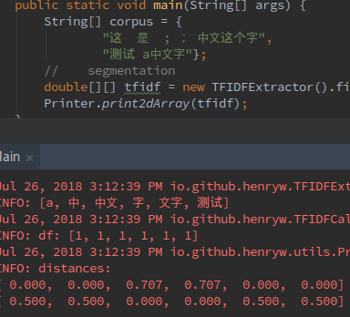

# Demo tf_idf
Follow the sklearn api http://scikit-learn.org/stable/modules/feature_extraction.html


## TODO
- org.ansj.library.DicLibrary error
```
 org.ansj.library.DicLibrary error
SEVERE: Init ambiguity library error :org.ansj.exception.LibraryException:  path :library/default.dic demo_tf_idf/library/default.dic not found or can not to read, path: library/default.dic

```
